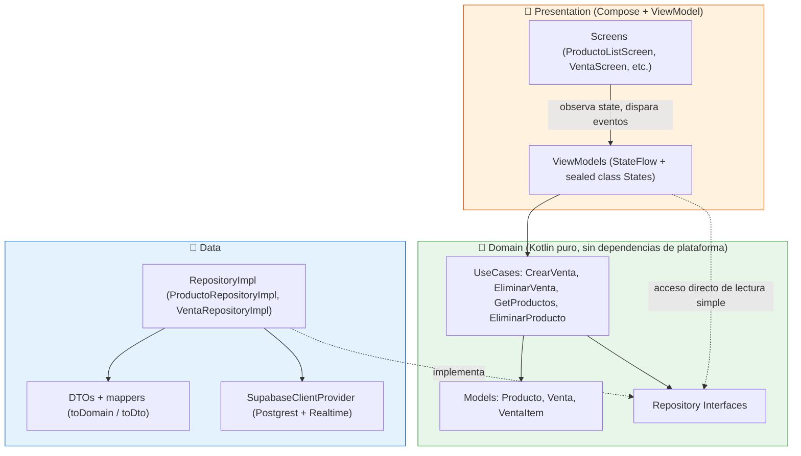
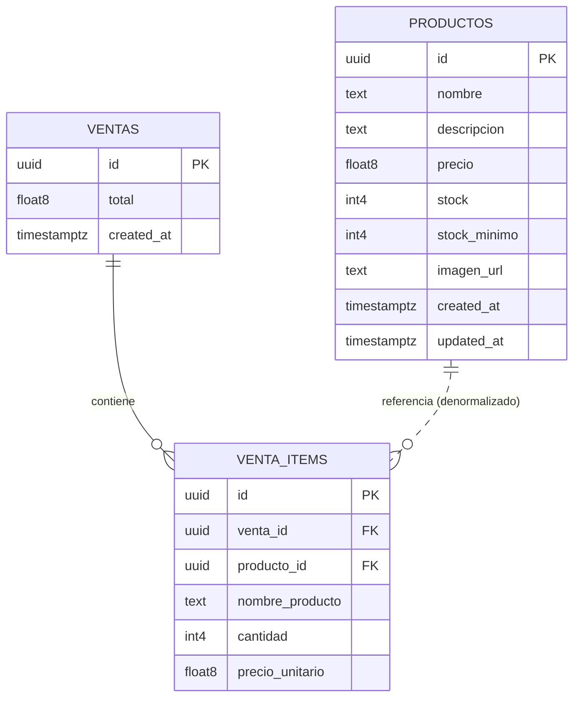
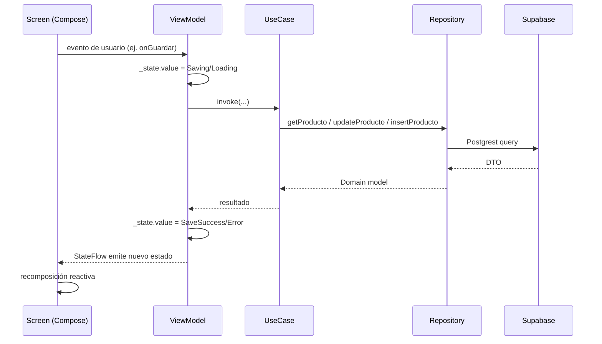

# 📦 Stock Manager

App móvil de **gestión de inventario y ventas** para un comercio pequeño (tipo almacén de barrio), desarrollada como Challenge Técnico para la posición de **Software Engineer Mobile en AranguriApps**.

Permite administrar el catálogo de productos (con stock, precio e imagen), registrar ventas descontando stock automáticamente, y consultar el historial de ventas — todo sincronizado en tiempo real contra un backend **Supabase**.

> Construido con **Kotlin Multiplatform (KMP)** + **Compose Multiplatform**, apuntando a **Android** e **iOS** desde una única base de código compartida.

---

## 📋 Tabla de contenidos

- [De qué trata el proyecto](#-de-qué-trata-el-proyecto)
- [Stack tecnológico](#-stack-tecnológico)
- [Arquitectura](#-arquitectura)
- [Estructura del proyecto](#-estructura-del-proyecto)
- [Modelo de datos (Supabase)](#-modelo-de-datos-supabase)
- [Funcionalidades](#-funcionalidades)
- [Manejo de estado y navegación](#-manejo-de-estado-y-navegación)
- [Multiplataforma: expect/actual](#-multiplataforma-expectactual)
- [Testing](#-testing)
- [Herramientas de IA utilizadas](#-herramientas-de-ia-utilizadas)
- [Cómo compilar y correr el proyecto](#-cómo-compilar-y-correr-el-proyecto)
- [Decisiones técnicas y trade-offs](#-decisiones-técnicas-y-trade-offs)
- [Mejoras y funcionalidades futuras](#-mejoras-y-funcionalidades-futuras)

---

## 🎯 De qué trata el proyecto

**Stock Manager** resuelve un problema real de un comercio chico: saber qué tengo, a qué precio, y qué vendí.

La app tiene dos flujos principales, conectados entre sí por lógica de negocio (no son pantallas aisladas):

1. **Productos**: alta, edición, baja y listado de productos con control de stock (con alertas visuales de "stock bajo" y "sin stock").
2. **Ventas**: armado de un carrito de venta, confirmación (que descuenta stock de cada producto vendido) e historial de ventas (donde eliminar una venta *devuelve* el stock automáticamente).

Ese acoplamiento intencional entre `Producto` y `Venta` (el stock se descuenta/devuelve según el ciclo de vida de una venta) es el corazón del dominio y es lo que se buscó modelar prolijamente en la capa de `domain`, en vez de dejarlo como lógica dispersa en la UI.

---

## 🛠 Stack tecnológico

| Categoría | Tecnología |
|---|---|
| Lenguaje | Kotlin (KMP) |
| UI | Compose Multiplatform (Material 3) |
| Arquitectura | Clean Architecture + MVVM |
| Inyección de dependencias | Koin |
| Backend / BaaS | Supabase (Postgrest + Realtime) |
| Networking | Ktor (OkHttp en Android) |
| Serialización | kotlinx.serialization |
| Navegación | Navigation Compose |
| Concurrencia | Kotlin Coroutines + Flow |
| Testing | kotlin.test + kotlinx-coroutines-test |
| Manejo de imágenes | ActivityResultContracts (Android) + Base64 (multiplataforma) |

---

## 🏗 Arquitectura

Se eligió **Clean Architecture** combinada con **MVVM** en la capa de presentación. La razón principal es que el proyecto es KMP: separar bien `domain` de `data` permite que toda la lógica de negocio (cálculo de subtotales/totales, validaciones de stock, reglas de "qué pasa cuando elimino una venta") viva en Kotlin puro, sin ninguna dependencia de Android/iOS, y sea 100% testeable con `kotlin.test` en `commonTest`.



**Reglas de dependencia:**
- `domain` no conoce a `data` ni a `presentation` (solo define interfaces `ProductoRepository` / `VentaRepository`).
- `data` implementa esas interfaces y es la única capa que sabe que existe Supabase.
- `presentation` depende de `domain` (modelos + casos de uso), nunca de `data` directamente.
- **Koin** (`AppModule.kt`) es quien conecta todo en runtime, inyectando `ProductoRepositoryImpl`/`VentaRepositoryImpl` donde se pide `ProductoRepository`/`VentaRepository`.

### ¿Por qué no casos de uso para todo?

Para operaciones de lectura simple (ej. `ProductoDetailViewModel` leyendo un producto) se inyecta el `Repository` directamente en el ViewModel. Los **UseCases** se reservaron para operaciones que **orquestan reglas de negocio no triviales** que involucran más de una entidad:

- `CrearVentaUseCase`: valida stock suficiente en todos los items *antes* de descontar, descuenta stock producto por producto, y recién ahí crea la venta.
- `EliminarVentaUseCase`: recupera la venta, devuelve el stock a cada producto (ignorando productos ya borrados, ver `EliminarVentaUseCaseTest`) y luego borra la venta.
- `EliminarProductoUseCase` / `GetProductosUseCase`: simples, pero se mantienen como UseCase por consistencia y para no filtrar el `Repository` completo a la UI.

Esto evita "Repositories gordos" con lógica de negocio adentro, y hace que esa lógica (la parte más importante y riesgosa del dominio: mover stock) esté 100% cubierta por tests unitarios con fakes.

---

## 📁 Estructura del proyecto

```
com.example.stockmanager
├── domain
│   ├── model            → Producto, Venta, VentaItem (con reglas: sinStock, stockBajo, subtotal, calcularTotal)
│   ├── repository       → ProductoRepository, VentaRepository (interfaces)
│   └── usecase
│       ├── producto     → GetProductosUseCase, EliminarProductoUseCase
│       └── venta        → CrearVentaUseCase, EliminarVentaUseCase
│
├── data
│   ├── remote            → ProductoDto, VentaDto, VentaItemDto (+ mappers toDomain/toDto), SupabaseClientProvider
│   └── repository        → ProductoRepositoryImpl, VentaRepositoryImpl (Supabase Postgrest)
│
├── di
│   └── AppModule.kt       → Módulo de Koin (repos, usecases, viewmodels)
│
├── presentation
│   ├── navigation         → MainBottomBar, rutas con/sin bottom bar
│   ├── components         → ProductoCard (reutilizable)
│   ├── productos
│   │   ├── lista          → ProductoListScreen + ProductoListViewModel (búsqueda, orden, undo-delete)
│   │   ├── detalle        → ProductoDetailScreen + ProductoDetailViewModel
│   │   └── form           → ProductoFormScreen + ProductoFormViewModel (alta/edición + imagen)
│   └── venta
│       ├── nueva          → VentaScreen + VentaViewModel (carrito de venta)
│       ├── lista          → VentaListScreen + VentaListViewModel (historial, undo-delete)
│       └── detalle        → VentaDetailScreen + VentaDetailViewModel
│
├── utils                  → FormatUtils (precio/fecha), ImagePicker (expect/actual), ImageUtils (expect/actual)
│
├── App.kt                 → Composable raíz: Koin + NavHost + Scaffold + Bottom Navigation
├── Platform.kt            → expect/actual de info de plataforma
└── (androidMain / iosMain) → Implementaciones específicas de cada target
```

Tests en `commonTest`, reflejando 1:1 la estructura de `commonMain` (domain models, use cases, viewmodels con fakes).

---

## 🗄 Modelo de datos (Supabase)

Backend elegido: **Supabase** (Postgrest + Realtime), cumpliendo con el requisito de que la app tenga comunicación real con el exterior (no hay datos mockeados/locales).



**Nota de diseño:** `venta_items` guarda una copia (`nombre_producto`, `precio_unitario`) del producto al momento de la venta, en vez de solo la FK. Esto es intencional: si el precio o nombre de un producto cambia después, el historial de ventas pasadas no debe mutar retroactivamente (es una **foto** del momento de la venta, como haría cualquier sistema de facturación real).

La imagen del producto se guarda como **Data URI Base64** (`data:image/jpeg;base64,...`) directamente en la columna `imagen_url`, evitando la necesidad de configurar Supabase Storage para el alcance de este challenge.

---

## ✨ Funcionalidades

### Productos
- Listado con **búsqueda** (por nombre y descripción) y **3 modos de orden** (alfabético, menor stock, mayor stock).
- Indicadores visuales de **stock bajo** (⚠️ naranja) y **sin stock** (🔴 error), configurables por producto vía `stock_minimo`.
- Alta y edición con formulario validado (nombre, precio y stock obligatorios/numéricos).
- Selección de foto desde **galería o cámara** (expect/actual `ImagePickerLauncher`).
- Eliminar producto con **confirmación** (`AlertDialog`) + **Undo** vía Snackbar (usando `SavedStateHandle` para pasar el producto eliminado entre pantallas y poder restaurarlo).

### Ventas
- Armado de carrito: selector de producto en `ModalBottomSheet` (solo muestra productos con stock > 0), control de cantidad limitado al stock disponible.
- Confirmación de venta con resumen (total + cantidad de productos) antes de descontar stock.
- **Transacción de negocio real**: `CrearVentaUseCase` valida stock de *todos* los items antes de tocar nada, y recién después descuenta y persiste — evitando dejar el sistema en un estado inconsistente si un producto no tiene stock suficiente.
- Historial de ventas ordenado por fecha (más reciente primero).
- Eliminar venta con confirmación + **devolución automática de stock** + **Undo** (recrea la venta, lo que vuelve a descontar el stock correctamente).

### Generales
- **Bottom Navigation** entre Productos y Ventas, oculta automáticamente en pantallas de detalle/formulario.
- Manejo de estados de carga/error consistente en toda la app vía `sealed class State` + `StateFlow` por pantalla.
- Feedback vía `Snackbar` para éxito, error y confirmaciones "Deshacer".

---

## 🧭 Manejo de estado y navegación

Cada feature sigue el mismo patrón **MVVM unidireccional**:



- **Estado**: cada ViewModel expone un `StateFlow<SealedState>` (`Loading`, `Loaded/Success`, `Saving/Deleting`, `Error`, `Empty` según el caso). La UI hace `collectAsStateWithLifecycle()` y un `when` exhaustivo — no hay banderas booleanas sueltas (`isLoading`, `hasError`, etc.) que puedan desincronizarse entre sí.
- **Navegación**: Navigation Compose con rutas simples (`producto/{id}/detalle`, `venta/nueva`, etc.). La comunicación entre pantallas (ej. "se eliminó un producto, mostrame el Undo en la lista anterior") se resuelve con `SavedStateHandle` sobre el `previousBackStackEntry`, serializando el objeto a JSON con `kotlinx.serialization` en vez de pasarlo como argumento de navegación (más seguro para objetos complejos y evita URLs gigantes).
- **DI**: Koin resuelve ViewModels vía `koinViewModel<T>()` en cada `Screen`, e inyecta automáticamente los `UseCase`/`Repository` que cada uno necesita (ver `AppModule.kt`).

---

## 🔀 Multiplataforma: expect/actual

Se usó KMP con Compose Multiplatform apuntando a **Android** e **iOS**. Los puntos donde cada plataforma necesita código nativo están aislados con `expect`/`actual`:

| Contrato (`commonMain`) | Android | iOS |
|---|---|---|
| `getPlatform(): Platform` | `Build.VERSION.SDK_INT` | `UIDevice.currentDevice` |
| `rememberImagePicker(...)` | `ActivityResultContracts` (galería + cámara, funcional) | Implementado como *stub* (ver nota abajo) |
| `ByteArray.toImageBitmap()` | `BitmapFactory` | `org.jetbrains.skia.Image` |
| `Base64Factory` | `android.util.Base64` | `NSData` + `kotlinx.cinterop` |

> **Nota honesta sobre iOS:** por limitaciones de entorno (sin macOS disponible durante el challenge), el target iOS **compila** y comparte el 100% de la lógica de negocio, ViewModels y UI (Compose Multiplatform), pero el selector de imagen (`ImagePicker.ios.kt`) quedó como *stub* (no dispara `UIImagePickerController`/`PHPickerViewController` real). El resto de los flujos (productos, ventas, navegación, Supabase) es completamente funcional en ambas plataformas al compartir la misma capa `domain`+`presentation`.

---

## 🧪 Testing

Se priorizó testear la capa de `domain` (donde vive el riesgo real: mover stock) y los `ViewModel` con **fakes** en memoria, en vez de mockear Supabase directamente.

```
domain/model         → VentaItemTest, VentaTest, ProductoTest        (reglas de negocio puras)
domain/usecase       → CrearVentaUseCaseTest, EliminarVentaUseCaseTest, 
                        EliminarProductoUseCaseTest, GetProductosUseCaseTest
domain/repository    → FakeProductoRepository, FakeVentaRepository   (test doubles)
presentation/*       → *ViewModelTest (uno por ViewModel, con BaseViewModelTest 
                        para configurar UnconfinedTestDispatcher)
```

Casos de borde cubiertos explícitamente:
- Venta con **stock insuficiente** → lanza excepción y **no** modifica stock ni persiste la venta (`CrearVentaUseCaseTest`).
- Eliminar una venta cuyo producto **ya fue borrado** del catálogo → no debe crashear, ignora ese item con `runCatching` (`EliminarVentaUseCaseTest`).
- Ordenamiento y búsqueda combinados en la lista de productos.
- Flujo completo de "Deshacer eliminación" tanto de producto como de venta.

Para correr los tests:
```bash
./gradlew :shared:allTests          # todos los targets
./gradlew :shared:testDebugUnitTest # solo Android
```

---

## 🤖 Herramientas de IA utilizadas

Este challenge se hizo cumpliendo el requisito de orquestar IA como parte activa del flujo de desarrollo, no como "autocompletado", combinando dos herramientas con roles distintos:

- **Google Antigravity (con Gemini)**, usado como IDE agéntico para la **generación de código** dentro del proyecto: creación y edición de archivos Kotlin, ejecución de builds/tests directamente sobre el repo, y resolución de errores de compilación específicos de KMP. Al ser un IDE agéntico con acceso directo al filesystem y al build, se usó para el trabajo "de manos en el código": generar clases completas a partir de una consigna, iterar sobre errores de compilación reales y correr los tests.
- **Claude (Anthropic)**, usado como asistente conversacional para la **capa de diseño y criterio**: discutir y validar decisiones de arquitectura (Clean Architecture + qué operaciones merecen un `UseCase` propio vs. acceso directo al `Repository`), definir casos de borde a testear (stock insuficiente, producto eliminado antes de devolver stock), revisar la lógica de negocio ya generada, y documentación.

**Mi rol como auditor del código generado** (según lo pedido en el challenge): en cada entrega de la IA yo:
1. Revisé que la lógica de negocio de stock (`CrearVentaUseCase`/`EliminarVentaUseCase`) fuera correcta y la until testeé con casos de borde reales (stock insuficiente, producto eliminado).
2. Corregí imports/paquetes y ajusté los `expect`/`actual` para que compilaran en ambos targets.
3. Decidí manualmente qué operaciones merecían un `UseCase` propio vs. acceso directo al `Repository` desde el ViewModel (ver sección de Arquitectura).
4. Verifiqué manualmente los flujos de UI (Undo, confirmaciones, estados de carga) en el emulador antes de considerarlos terminados.

---

## 🚀 Cómo compilar y correr el proyecto

### Requisitos previos
- **Android Studio** (última versión estable, con plugin de Compose Multiplatform).
- **JDK 17+**.
- Para el target iOS: **macOS** + **Xcode** (no obligatorio para evaluar la versión Android).
- Cuenta de Supabase (opcional — el proyecto ya viene apuntando a una instancia propia configurada en `SupabaseClientProvider.kt` para que funcione out-of-the-box).

### 1. Clonar el repositorio
```bash
git clone <URL_DEL_REPOSITORIO>
cd stock-manager
```

### 2. Android
Desde Android Studio: `Open` → seleccionar la carpeta del proyecto → esperar sync de Gradle → correr la configuración `androidApp` (▶️) sobre un emulador o dispositivo físico.

O por línea de comandos:
```bash
./gradlew installDebug
```

> Si el módulo Android se llama distinto en tu estructura final de carpetas (por ejemplo `composeApp` en vez de `androidApp`), ajustá el nombre de la tarea de Gradle acorde (`./gradlew :<nombre-del-modulo>:installDebug`).

### 3. iOS (requiere macOS)
```bash
cd iosApp
pod install   # si el proyecto usa CocoaPods; con Swift Package Manager no es necesario
open iosApp.xcodeproj
```
Correr desde Xcode sobre un simulador.

### 4. Backend (Supabase)
El proyecto ya apunta a una instancia de Supabase configurada (ver `SupabaseClientProvider.kt`) con las tablas `productos`, `ventas` y `venta_items` (ver [modelo de datos](#-modelo-de-datos-supabase)). Si querés usar tu propia instancia:
1. Creá un proyecto en [supabase.com](https://supabase.com).
2. Creá las 3 tablas con las columnas descriptas arriba.
3. Reemplazá `supabaseUrl` y `supabaseKey` en `SupabaseClientProvider.kt` por los de tu proyecto.

### 5. APK
Se adjunta un **APK instalable** junto a la entrega del challenge, generado con:
```bash
./gradlew assembleDebug
```

---

## ⚖️ Decisiones técnicas y trade-offs

| Decisión | Por qué |
|---|---|
| Clean Architecture + MVVM sobre un patrón más simple (MVC/MVI puro) | El dominio tiene reglas no triviales (descuento/devolución de stock atado al ciclo de vida de una venta) que necesitaban vivir aisladas y testeables, sin acoplarse a Compose ni a Supabase. |
| Supabase en vez de un mock server propio | El challenge lo recomienda explícitamente como opción preferida, y permite tener persistencia y comunicación de red real (requisito puntuado) sin la sobrecarga de mantener un servidor Express aparte durante 7 días. |
| Imagen como Base64 en la fila del producto (no Supabase Storage) | Reduce la superficie de configuración (bucket, políticas de acceso público) para el alcance del challenge, a costa de filas más pesadas — ver [mejoras futuras](#-mejoras-y-funcionalidades-futuras). |
| `venta_items` denormalizada (copia nombre/precio) | El historial de ventas no debe cambiar si el producto se edita o elimina después — comportamiento esperado en cualquier sistema de ventas real. |
| UseCase solo para orquestación multi-entidad, Repository directo para lecturas simples | Evita el anti-patrón de "UseCase de una línea que solo delega" sin aportar valor, sin perder testabilidad donde realmente importa. |
| Undo vía Snackbar + SavedStateHandle en vez de soft-delete en la base | Mantiene el esquema de datos simple; el "deshacer" es una operación de UX que re-inserta el registro, no un estado de la base. |

---

## 🔮 Mejoras y funcionalidades futuras

- [ ] Implementar el selector de imagen real en iOS (`PHPickerViewController` / `UIImagePickerController`), hoy stub.
- [ ] Migrar imágenes de Base64 a **Supabase Storage** con URLs firmadas, para no engordar las filas de `productos` y permitir CDN/caching.
- [ ] Aprovechar **Realtime** de Supabase (ya instalado como dependencia) para sincronizar la lista de productos entre múltiples dispositivos sin necesidad de pull-to-refresh.
- [ ] Autenticación de usuarios (Supabase Auth) para soportar múltiples comercios/usuarios sobre la misma base.
- [ ] Reportes de ventas (por período, por producto más vendido) usando agregaciones de Postgrest o una vista SQL.
- [ ] Paginación en el listado de productos/ventas para catálogos grandes (hoy se trae todo en una sola query).
- [ ] CI (GitHub Actions) corriendo `./gradlew allTests` + `ktlint` en cada PR.
- [ ] Modo offline con cache local (SQLDelight) y sincronización diferida contra Supabase.
- [ ] Tests de UI con `compose-test` para los flujos críticos (confirmar venta, eliminar con undo).

